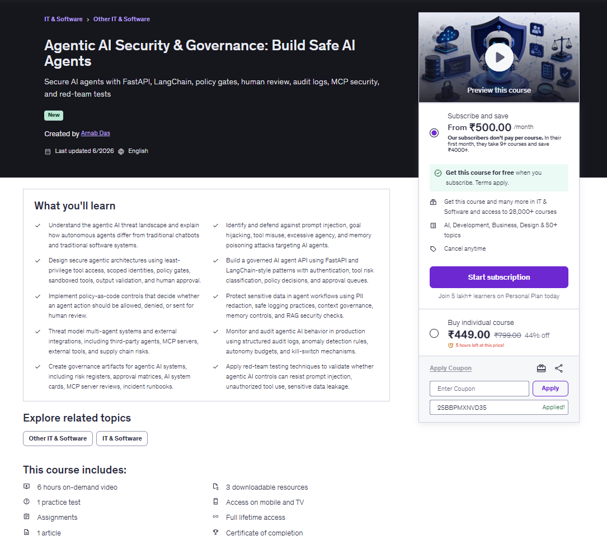

<h1 align="center">
  <a href="https://www.udemy.com/course/agentic-ai-security-governance-build-safe-ai-agents">
    Agentic AI Security & Governance: Build Safe AI Agents
  </a>
</h1>

<p align="center">
  Secure AI agents with FastAPI, LangChain, policy gates, human review, audit logs, MCP security, and red-team tests
</p>

<p align="center">
  
</p> 

This project is the companion codebase for the **Agentic AI Security and Governance** course. It demonstrates how to securely architect, govern, and monitor autonomous AI agents using a robust defense-in-depth approach.

## The Core Security Boundary

The most critical architectural principle taught in this course is establishing a firm boundary between an AI's intent and actual system execution:

1. **Agent proposes a tool call.**
2. **[ SECURITY & GOVERNANCE GATE ]**
3. **Tool actually executes.**

Everything in this project is designed to protect this boundary, ensuring that generative AI models (which are inherently non-deterministic) cannot directly execute high-risk actions without explicit authorization, policy checks, and potentially human review.

## Security Controls Implemented

The framework categorizes security measures into distinct control layers. This repository includes working implementations of each:

### 1. Input Controls
*   **Authentication & Least Privilege (`auth.py`)**: Assigns API keys to `Principal` identities, granting them specific scopes and roles (e.g., `learner`, `admin`, `reviewer`).
*   **PII Redaction (`pii.py`)**: Intercepts user inputs to detect and redact Personally Identifiable Information (Emails, Phone Numbers, Account IDs) *before* they are sent to the LLM or stored in audit logs.
*   **Context Security (`context_security.py`)**: Wraps retrieved document context in clear delimiters to prevent untrusted data from masquerading as system instructions.

### 2. Planning Controls
*   **Live LangChain Integration (`agent.py`)**: Uses a LangChain planner powered by `gpt-4o` that proposes actions, seamlessly dropping into the security gates for evaluation. Falls back to a deterministic planner if no API key is provided.
*   **Goal Integrity (`goal.py`)**: Classifies the user's overarching intent and ensures the tools proposed by the agent align with that approved goal (preventing goal hijacking).
*   **Security Signals (`security_signals.py`)**: Detects known prompt injection and jailbreak phrases.
*   **Autonomy Budgets (`autonomy.py`)**: Hardcodes limits on how many sequential actions an agent can take without requiring a pause or re-authorization.

### 3. Policy Controls
*   **Policy Engine (`policy.py` & `agentic.rego`)**: Evaluates every proposed tool call against organizational rules. Decisions result in `allow`, `deny`, or `review`. It evaluates risk levels, tenant isolation, and required scopes.
*   **Multi-Agent Delegation (`multi_agent.py`)**: Enforces cryptographic signing and strict policies on which agents (e.g., `support-agent`) can delegate tasks to other agents (e.g., `billing-agent`).

### 4. Execution Controls
*   **Approval Queue / Human-in-the-Loop (`approvals.py`)**: When the policy engine returns `review`, execution is paused, and the request is queued. Human reviewers can approve, edit, reject, or safely respond without executing the tool.
*   **Sandboxed Execution (`sandbox.py`)**: Validates argument sizes and hard-blocks overly broad execution tools (like `run_shell` or `raw_sql`).
*   **MCP Tool Review (`mcp_review.py`)**: Evaluates dynamically loaded Model Context Protocol (MCP) tools against an approved registry before allowing their use.

### 5. Output Controls
*   **Output Validation (`output_validation.py`)**: Inspects the drafted outputs of tools (such as external customer emails) for sensitive requests (e.g., asking for passwords or API keys) before they are sent.

### 6. Monitoring & Operations
*   **Audit Logging (`audit.py`)**: Maintains a tamper-evident JSONL audit trail of all requests, proposed tools, policy decisions, redaction counts, and reviewer actions.
*   **Anomaly Detection (`monitoring.py`)**: Scans the audit trail for spikes in high-risk tool usage or repeated denied actions, generating alerts.
*   **Circuit Breakers (`circuit_breaker.py`)**: Detects cascading failures or high-risk activity across multiple agents and trips a breaker to halt execution.
*   **Kill Switch (`kill_switch.py`)**: Allows administrators to immediately disable specific tools globally without redeploying the application.

### 7. Governance Evidence
Located in the `templates/` directory, these markdown artifacts are essential for demonstrating compliance to auditors:
*   **System Cards (`ai_system_card.md`)**
*   **Deployment Readiness Checklists (`deployment_readiness_checklist.md`)**
*   **Data Classification Guidelines (`data_classification.md`)**
*   **Third-Party Component Inventory (`third_party_component_inventory.md`)**
*   **RAG Ingestion Checklists (`rag_ingestion_checklist.md`)**
*   **MCP Server Reviews (`mcp_server_review.md`)**

## Setup and Usage

Install the required dependencies (including LangChain support):
```bash
pip install -r requirements.txt
```

Run the tests to see the security controls in action:
```bash
python -m unittest discover -s agentsecgov/tests
```

To enable the live LangChain planner, create a `.env` file in the root directory (you can copy `.env.example`) and add your OpenAI API key:
```bash
OPENAI_API_KEY="your-api-key"
```

To run the live server locally:
```bash
python run.py
```
This will start the FastAPI application on `http://127.0.0.1:8000`.

## Red Team Testing

To validate that the framework's security controls actually work against adversarial threats, this repository includes a dedicated red-team test suite (`agentsecgov/tests/test_red_team.py`). 

The suite tests the agent against the following techniques:
1. **Prompt Injection**: Attempts to override system instructions and bypass guardrails.
2. **Unauthorized Tool Use via Social Engineering**: Attempts to masquerade as an authority (e.g., the CEO) to trigger critical tools without the proper cryptographic scope.
3. **Sensitive Data Leakage**: Attempts to exfiltrate or pass PII (emails, phone numbers) through the LLM.
4. **Goal Hijacking**: Attempts to embed a destructive secondary payload (e.g., deleting a record) inside a benign primary request.

To run the red-team suite:
```bash
python -m unittest agentsecgov/tests/test_red_team.py
```

## Course Outline

### Section 1: Agentic AI Threat Landscape
| Lecture | Title |
| ------- | :---- |
| 1.1     | Welcome: Why Agentic Security Matters |
| 1.2     | How AI Agents Differ from Traditional Software |
| 1.3     | Agents as an Attack Surface and as Attacker Tools |
| 1.4     | OWASP LLM and OWASP Agentic AI Risk Landscape |
| 1.5     | Course Project Architecture Walkthrough |

### Section 2: Secure Agentic Architecture
| Lecture | Title |
| ------- | :---- |
| 2.1     | FastAPI as the Agent Control Plane |
| 2.2     | Agent Loop: Planner, Tools, Memory, Policy, Output |
| 2.3     | Tool Schemas and Action Boundaries |
| 2.4     | Least-Privilege Tool Design |
| 2.5     | Sandboxing Agent Tools and External Integrations |
| 2.6     | Output Validation Before Action |

### Section 3: Prompt Injection, Goal Hijacking, and Tool Misuse
| Lecture | Title |
| ------- | :---- |
| 3.1     | Prompt Injection Against AI Agents |
| 3.2     | Indirect Prompt Injection Through RAG, Tools, and Memory |
| 3.3     | Goal Hijacking and Goal Integrity Checks |
| 3.4     | Tool Misuse and Excessive Agency |
| 3.5     | Detecting Agent Attack Signals |
| 3.6     | Lab: Build Attack Detection Tests |

### Section 4: Identity, Authorization, and Policy-as-Code
| Lecture | Title |
| ------- | :---- |
| 4.1     | Identity for Users, Agents, Tools, and Services |
| 4.2     | Scoped API Keys and Least Privilege |
| 4.3     | OPA/Rego Policy-as-Code Concepts |
| 4.4     | Policy Enforcement Points in FastAPI |
| 4.5     | Human Review as a Policy Decision |
| 4.6     | Lab: Allow, Deny, and Review Decisions |

### Section 5: Data, Memory, RAG, and MCP Security
| Lecture | Title |
| ------- | :---- |
| 5.1     | Sensitive Data Disclosure and Prompt Leakage |
| 5.2     | PII Redaction with Presidio-Style Controls |
| 5.3     | Memory Poisoning and Context Governance |
| 5.4     | RAG Threats: Poisoned Documents and Cross-Tenant Retrieval |
| 5.5     | MCP Server Security and Tool Discovery Risk |
| 5.6     | Third-Party Agent and Tool Supply Chain Risk |

### Section 6: Human Oversight, Monitoring, and Production Defense
| Lecture | Title |
| ------- | :---- |
| 6.1     | Human-in-the-Loop Approval Patterns |
| 6.2     | Approval Queues and Decision Records |
| 6.3     | Approve, Edit, Reject, and Respond Workflows |
| 6.4     | Audit Logs for Agentic AI |
| 6.5     | OpenTelemetry-Style Tracing for Agent Workflows |
| 6.6     | Production Anomaly Detection |
| 6.7     | Kill Switches and Autonomy Budgets |

### Section 7: Multi-Agent Threat Modeling and Governance
| Lecture | Title |
| ------- | :---- |
| 7.1     | Multi-Agent Architecture and Trust Boundaries |
| 7.2     | Insecure Inter-Agent Communication |
| 7.3     | Cascading Failures and Rogue Agent Behavior |
| 7.4     | Governance Frameworks for Agentic AI |
| 7.5     | Deployment Readiness and Acceptable Risk |
| 7.6     | Capstone Walkthrough |
